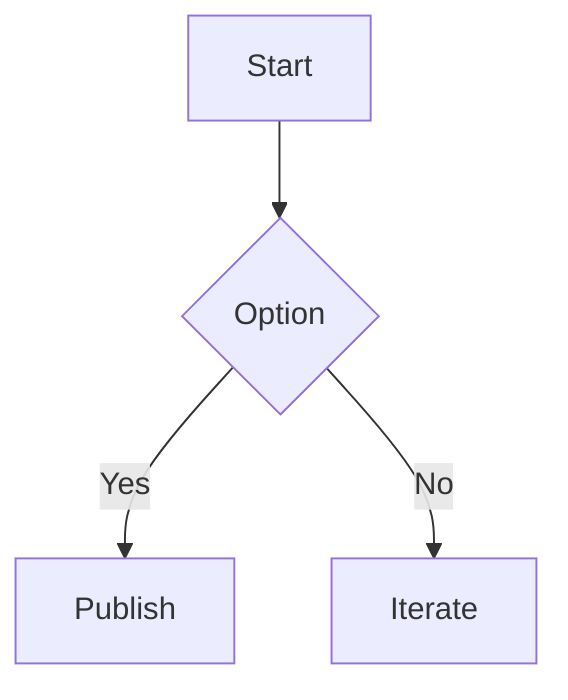

+++
title = 'Quick Start with the latest features'
date = '2025-10-26'
draft = false
tags = ['getting started','theme','mermaid','math','shortcodes']
translationKey = 'quick-start'
+++

## Why this post was updated

This post follows the latest demo structure and verifies current theme capabilities.



### Demonstrated features
- Table of contents (TOC)
- Shortcodes: `toc`, `tags`, `recent-posts`
- Mermaid diagram
- Math (KaTeX, if enabled)
- Image lightbox
- Copy + soft-wrap controls for code blocks
- Three theme modes: Light / Dark / Retro (NES pixel style)





### Mermaid



### Math

```passthrough
E = mc^2
```

### Image


You can replace this with a local image in a page bundle to let Hugo emit intrinsic dimensions for better lightbox rendering.

### Very long URL

- https://www.verylonglonglonglonglonglonglonglonglonglonglonglonglonglonglonglongdomain.com/news/new_center_opens_in_city_name_september_15_2023
