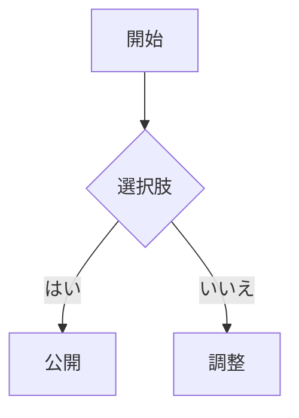

+++
title = '最新機能クイックスタート'
date = '2025-10-26'
draft = false
tags = ['入門','テーマ','mermaid','数学']
translationKey = 'quick-start'
+++

## この記事の更新理由

この投稿は最新のデモ構成に合わせて更新し、テーマの主要機能を確認できるようにしました。



### この記事の内容
- 目次（TOC）
- 短コード: `toc`、`tags`、`recent-posts`
- Mermaid 図
- 数式（KaTeX を有効化している場合）
- 画像ライトボックス
- コードブロックのコピー / ソフトラップ
- 3つのテーマモード: ライト / ダーク / レトロ（NES ピクセル風）





### Mermaid



### 数式

```passthrough
E = mc^2
```

### 画像


ページバンドルで画像を `index.md` と同じ場所に置くと、画像サイズが自動で付与され、ライトボックス表示が安定します。


### とても長いURL

- https://www.verylonglonglonglonglonglonglonglonglonglonglonglonglonglonglonglongdomain.com/news/new_center_opens_in_city_name_september_15_2023
