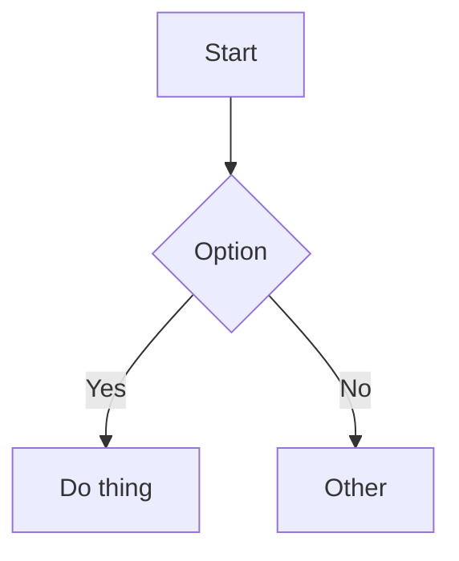

+++
title = 'Quick Start with trainsh'
date = '2025-10-26'
draft = false
tags = ['getting-started','theme','mermaid','math']
+++

## Typography & Layout

This is an English example post to preview the trainsh theme.

### Features in this post
- Headings (H2/H3)
- Mermaid diagram
- Math (KaTeX, if enabled)
- Image lightbox

### Mermaid



### Math

```passthrough
E = mc^2
```

### Image


