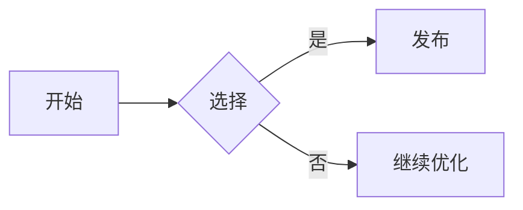

+++
title = '最新功能快速开始'
date = '2025-09-21'
draft = false
tags = ['入门','主题','mermaid','数学','短代码']
translationKey = 'quick-start'
+++

## 为什么更新这篇文章

这篇文章按最新的示例结构更新，用于验证当前版本的主题能力。

## 文章示例内容



- 二/三级标题
- 短代码：`toc`、`tags`、`recent-posts`
- Mermaid 图表
- 数学公式（KaTeX）
- 图片灯箱
- 代码块复制与换行控制

### Mermaid



### 数学公式

```passthrough
S = \pi r^2
```





### 图片


你可以把图片放到与 `index.md` 同目录的 page bundle 里，让主题自动写入图片尺寸，获得更稳的 lightbox 显示效果。
