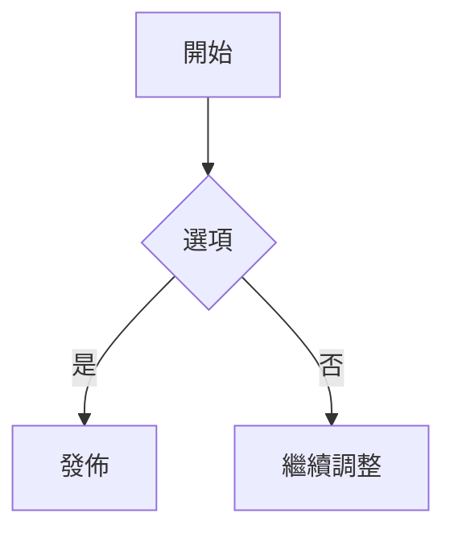

+++
title = '最新功能快速開始'
date = '2025-10-26'
draft = false
tags = ['入門','主題','mermaid','數學','短代碼']
translationKey = 'quick-start'
+++

## 為什麼要更新這篇文章

這篇文章改成新版示例，用於驗證目前主題功能。



### 本文包含的功能
- 目錄（TOC）
- 短代碼：`toc`、`tags`、`recent-posts`
- Mermaid 圖表
- 數學（若已啟用 KaTeX）
- 圖片燈箱
- 程式碼區塊複製與換行控制





### Mermaid



### 數學

```passthrough
E = mc^2
```

### 圖片


你可以用 page bundle 放置本地圖片，讓 Hugo 在輸出時帶入尺寸資訊，提升燈箱顯示穩定度。

### 超長網址

- https://www.verylonglonglonglonglonglonglonglonglonglonglonglonglonglonglonglongdomain.com/news/new_center_opens_in_city_name_september_15_2023
